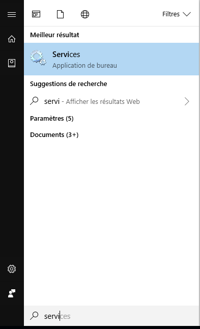
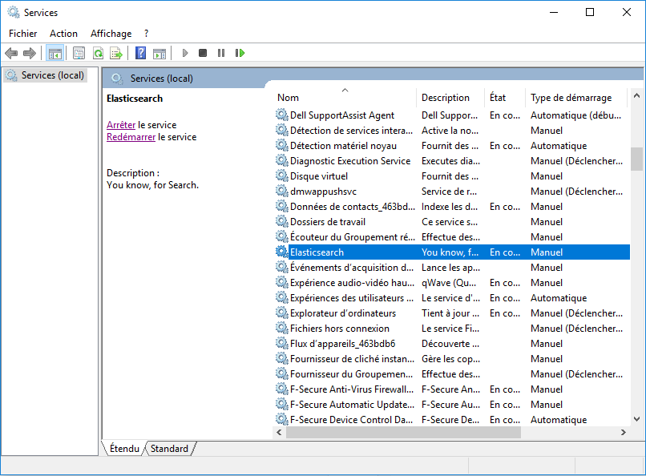

# Installer un plugin

Les plugins seront utiles pour ajouter des fonctionnalités à Elasticsearch. 

## Sous Windows

Il faut d'abord télécharger le dossier compressé .zip contenant le plugin souhaité. 

Une fois téléchargé, il faudra extraire son contenu dans le dossier "plugins" qui se trouve dans le corps d'Elasticsearch, c-à-d le dossier appelé "Home" lors de l'installation, souvent séparé des dossiers Data, Logs et Config. 

Le chemin du dossier des plugins à partir du dossier "Home" ou "Elasticsearch" : \Elasticsearch\6.2.2\plugins

Le plugin est maintenant bien positionné, il faut redémarrer le Node.
Tapez "Services" dans le menu Démarrer de Windows :

Une fenêtre va s'ouvrir, et il faudra chercher le service "Elasticsearch" :

Clic droit - Redémarrer.

Le plugin est maintenant installé et fonctionnel. 

## Sous Linux

Tous les créateurs de plugins mettront les commandes pour télécharger et installer leurs package donc je ne vais pas m'échiner à faire un quelconque tutoriel ici. 

Je redirige vers la [documentation spécifique](https://www.elastic.co/guide/en/elasticsearch/plugins/current/installation.html) qui se charge aussi très bien de dire comment faire.