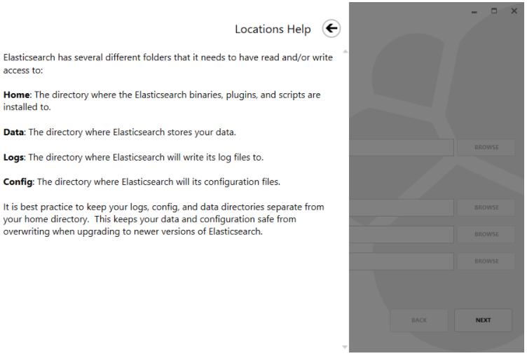
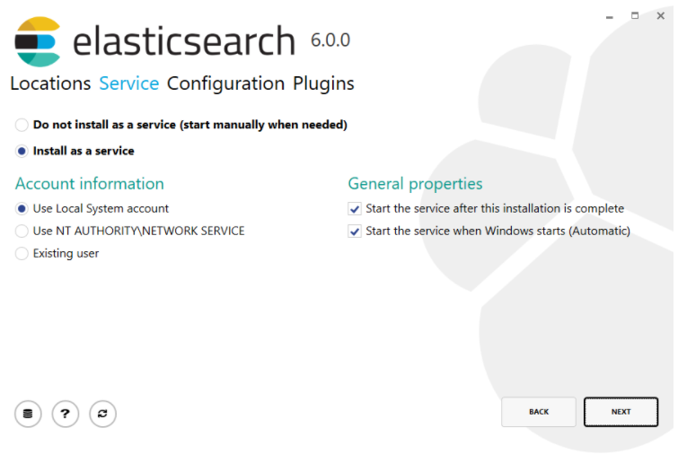

# Installation d'ElasticSearch et Configuration

## Prérequis

### Java
- Il est **crucial** d'installer en premier lieu (ou de mettre à jour) **Java 8 64bits**

Pour ce faire, suivez ce lien : [https://www.java.com/fr/download/manual.jsp](https://www.java.com/fr/download/manual.jsp).
>  :warning: Attention : L'installeur de Java choisira pour vous l'architecture (32 ou 64bits) de Java 8 à installer en fonction de celle de votre navigateur Internet Explorer.

Pour éviter ce problème d'automatisme de l'installeur proposé par défaut, il est nécessaire de choisir celui qui porte le nom `Windows Hors ligne (64 bits)`, comme montré ci-dessous.

### Les outils qui facilitent la vie

*  Comme vous êtes des utilisateurs de Google Chrome, il existe une extension qui propose une interface graphique de gestion et de traitement des Clusters, des Nodes, des Index et des Documents existant, un peu comme un phpMyAdmin. 

Vous pourrez vous la procurer ici : [Elasticsearch Head](https://chrome.google.com/webstore/detail/elasticsearch-head/ffmkiejjmecolpfloofpjologoblkegm)

L'extension n'est pas design mais semble faire le travail comme il se doit. 

*  Je vous propose un autre outil qui permettra de faciliter les tests d'appels URL : [Sense](https://github.com/StephaneBour/sense-chrome)

Il n'est plus à jour, et n'est plus officiellement utilisé par ElasticSearch, mais fait très bien son job. 
Pour l'installer, il suffit de suivre les étapes proposées sur le git qui est linké au dessus.

## ElasticSearch

Téléchargez ElasticSearch 6.2.2 à cette adresse : [https://artifacts.elastic.co/downloads/elasticsearch/elasticsearch-6.2.2.msi](https://artifacts.elastic.co/downloads/elasticsearch/elasticsearch-6.2.2.msi).

Une fois téléchargé, exécutez le. 
Une interface graphique vous guidera dans l'installation. 
Un bouton '?' vous permettra d'obtenir des renseignements et de l'aide sur ce que vous demande l'installateur. 

*Aperçu de l'aide d'une des fenêtres de l'installateur*

*  Dans la première fenêtre, l'installateur va vous proposer d'enregistrer 4 dossiers : Home, Data, Config, et Logs.

Il est préférable de séparer Home des autres afin de ne pas les écraser lors d'une grosse mise à jour par exemple. Les 3 autres peuvent rester ensemble sans problèmes.

*  La deuxième fenêtre ressemble à ça par défaut :

On peut décocher le démarrage automatique d'ElasticSearch au démarrage de Windows sans toucher au reste. 

*  La troisième fenêtre dispose de paramètres concernant le Cluster, le Node, les roles du Node, la mémoire allouée, ainsi que des paramètres réseaux. 

Il est important de choisir un nom de Cluster ainsi qu'un nom de Node.
Pour travailler en local, ne modifiez pas les paramètres réseaux.
Pour faire communiquer les Nodes entre eux, il est néanmoins important de rentrer une adresse ip différente de 127.0.0.1(localhost) celle-ci étant définie par défaut. Reprenez l'IP de votre machine  Le but étant de pouvoir communiquer à travers le réseau/Cluster.

*  La dernière fenêtre propose un listing de plugins officiels à intégrer lors de l'installation, ainsi que les paramètres du proxy. Aucun plugin n'est à télécharger ici, et il n'existe pas de proxy sur le réseau. 

Une fois ceci fait, ElasticSearch va s'installer et indiquera qu'il s'est installé avec succès. 
Il vous sera proposé d'ouvrir ES dans le navigateur, ce qui mènera à l'url suivant : [http://localhost:9200/](http://localhost:9200/)

Deux documentations (anglais) bien garnies sont aussi proposées. Elles compléteront la documentation ici présente.

Les deux dernières propositions n'ont pas d’intérêt pour nous. 

*  En ouvrant la page web ElasticSearch ([http://localhost:9200/](http://localhost:9200/)) vous devriez tomber sur ce bout de code en JSON :

> *Je vous conseille de passer directement par l'extension Chrome pour faire vos traitements. Dans la section "Autres requêtes", mettez vous en GET, supprimez tout le JSON en dessous et lancez la requête pour avoir le même résultat qu'au dessus.* 

On retrouve bien le nom du Node et du Cluster

`"name" > Nom du Node, ici node1`

`"cluster_name" > Nom du Cluster, ici cluster1`

Bien joué, ElasticSearch est installé. Maintenant il faut le configurer ! :face_with_cowboy_hat:

*Néanmoins, si l'installation pose problème ou bien si le système d'exploitation n'est pas le même, voici le lien vers la documentation complête de toutes les manières d'installer ES : [https://www.elastic.co/guide/en/elasticsearch/reference/current/install-elasticsearch.html](https://www.elastic.co/guide/en/elasticsearch/reference/current/install-elasticsearch.html).*

