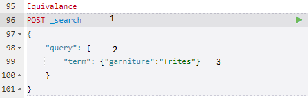
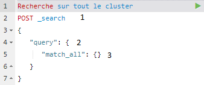

### [Recherche](#user-content-recherche)
*  [Recherche Globale et par ID](#user-content-globale-et-par-id)
*  [Recherche par Requête](#user-content-par-requête)

# Recherche 

## Par ID

Afin de récupérer les informations indexées dans un document spécifique, on utilise le code suivant : `GET /index/type/id`

Ainsi les champs et leurs valeurs seront retournés. 

## Par Requête - Termes

Pour faire des recherches par requête, quelques subtilités s'imposent. 

En RESTful, le GET ne peut pas avoir de body, le body étant le JSON que l'on envoit en dessous des liens. Pour contourner la chose, ElasticSearch à développé une API, Search, qui permet de faire de la lecture de données à travers le terme POST, qui accepte les bodys. 

### Récupération par équivalence

On recherche tous les documents dont un ou plusieurs champs possèdent exactement telles valeurs.

*  1 - On spécifie le terme `_search` obligatoire pour de la recherche en POST
*  2 - On fait une recherche donc on ajoute `query`
*  3 - `term` permet de faire une recherche par équivalence. La/les valeurs(s) et le/les champs entrés doivent être identiques pour renvoyer un résultat. 

## Par Requête - Chaines de caractères

###  Récupération de toutes les données du cluster :

*  1 - Afin de faire des recherches par requête, il est obligatoire d'être en POST **et** d'utiliser "_search" de l'API Search
*  2 - On indique que l'on souhaite faire une requête.
*  3 - "match_all" permet de récupérer tout les documents et leurs champs/valeurs du cluster

Notions abordées : 
-> Fuzyness
-> Wildcard
-> Multi searching
-> Analyzer
-> Aggregation
etc etc